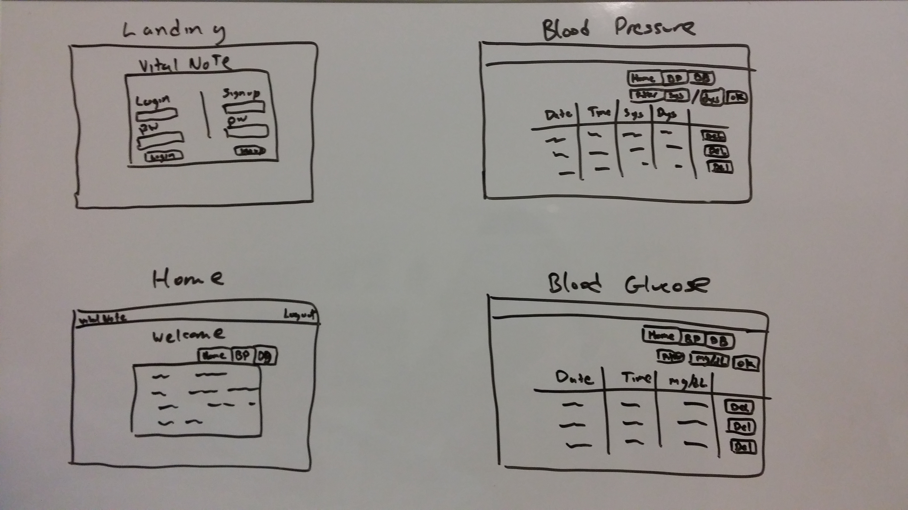
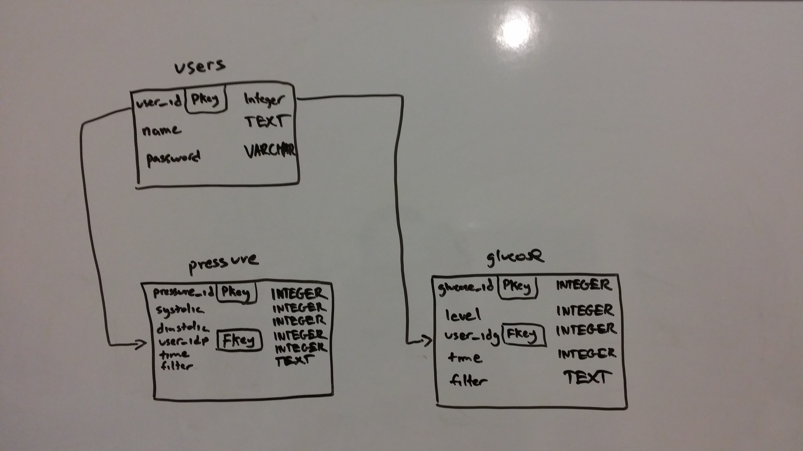

#VITAL NOTE

VITAL NOTE is a single-page application to help the user's PCP to determine whether their current or new medication is working for them.  Users can keep records of their blood pressure and blood sugar readings. Users can sort readings by month and print out the month's readings.

##Minimum Viable Product
* Users can log in
* Create, Read, and Delete for blood pressure readings
* Create, Read, and Delete for blood glucose readings
* Insert date/time automatically

##Wireframe

##ERD

##Routes
Backend

* app.get('/')
* app.get('/login')
* app.post('/login')
* app.get('/logout')
* app.post('/signup')
* app.get('/home')
* app.get('/api/pressures')
* app.post('/api/pressures')
* app.delete('/api/pressures/:id')
* app.get('/api/glucoses')
* app.post('/api/glucoses')
* app.delete('/api/glucoses/:id')

Frontend

* '/pressure'
* '/glucose'
* '/'

##Technologies
* HTML/CSS
* JavaScript
* Bootstrap
* Node.js
* Express.js
* Angular.js
* SQLite3
